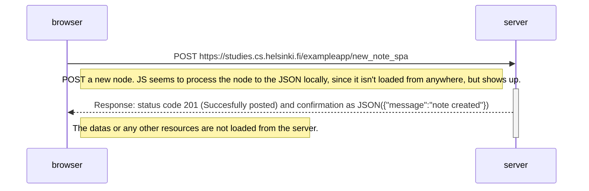

```mermaid
sequenceDiagram
    participant browser
    participant server

    browser->>server: POST https://studies.cs.helsinki.fi/exampleapp/new_note_spa
    Note right of browser:  POST a new node. JS seems to process the node to the JSON locally, since it isn't loaded from anywhere, but shows up.
    activate server
    server-->>browser: Response: status code 201  (Succesfully posted) and confirmation as JSON({"message":"note created"})
    Note right of browser: The datas or any other resources are not loaded from the server.
    deactivate server

```
