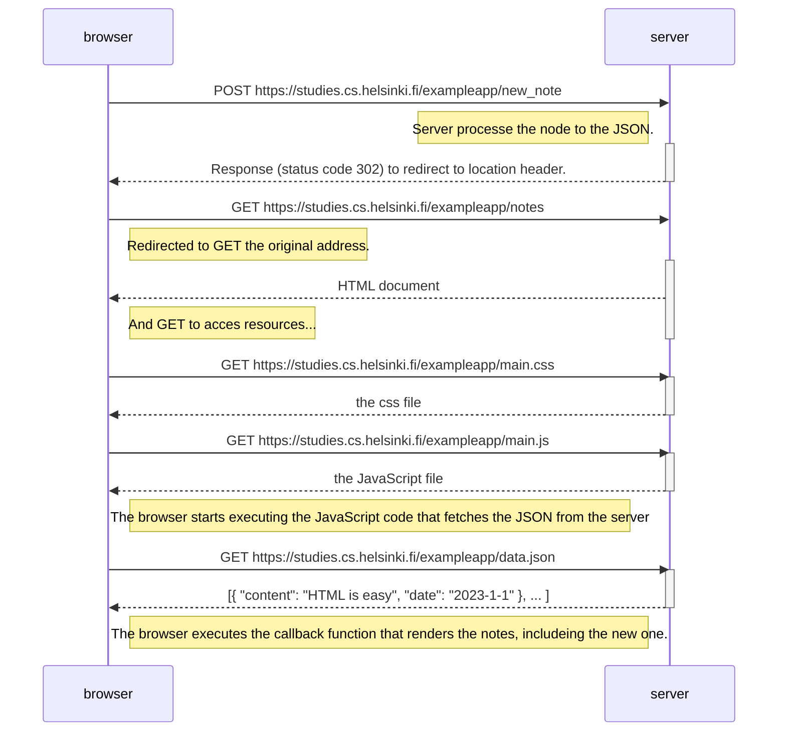

```mermaid
sequenceDiagram
    participant browser
    participant server
    browser->>server: POST https://studies.cs.helsinki.fi/exampleapp/new_note
    Note left of server: Server processe the node to the JSON.
    activate server
    server-->>browser: Response (status code 302) to redirect to location header.
    deactivate server
    browser->>server: GET https://studies.cs.helsinki.fi/exampleapp/notes
    Note right of browser: Redirected to GET the original address.
    activate server
    server-->>browser: HTML document
    Note right of browser: And GET to acces resources...
    deactivate server
    browser->>server: GET https://studies.cs.helsinki.fi/exampleapp/main.css
    activate server
    server-->>browser: the css file
    deactivate server
    browser->>server: GET https://studies.cs.helsinki.fi/exampleapp/main.js
    activate server
    server-->>browser: the JavaScript file
    deactivate server
    Note right of browser: The browser starts executing the JavaScript code that fetches the JSON from the server
    browser->>server: GET https://studies.cs.helsinki.fi/exampleapp/data.json
    activate server
    server-->>browser: [{ "content": "HTML is easy", "date": "2023-1-1" }, ... ]
    deactivate server
    Note right of browser: The browser executes the callback function that renders the notes, includeing the new one.
```
